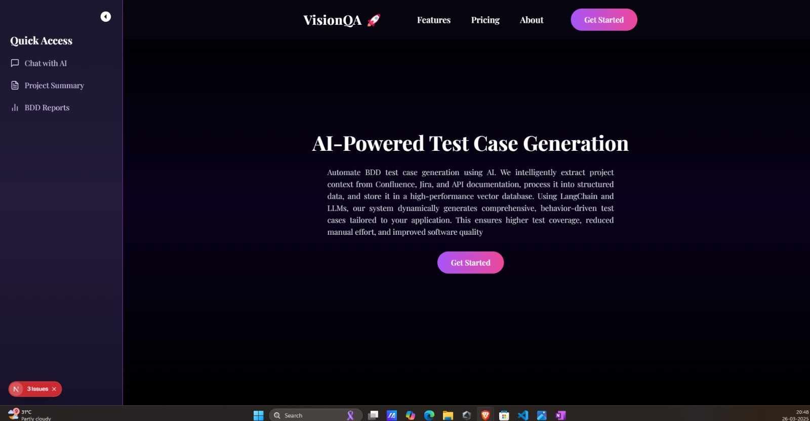
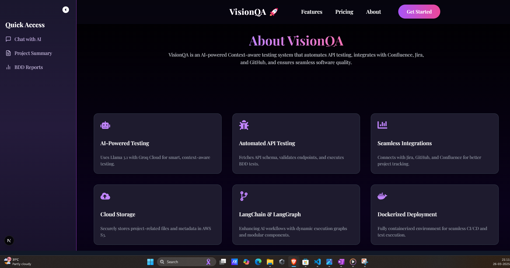
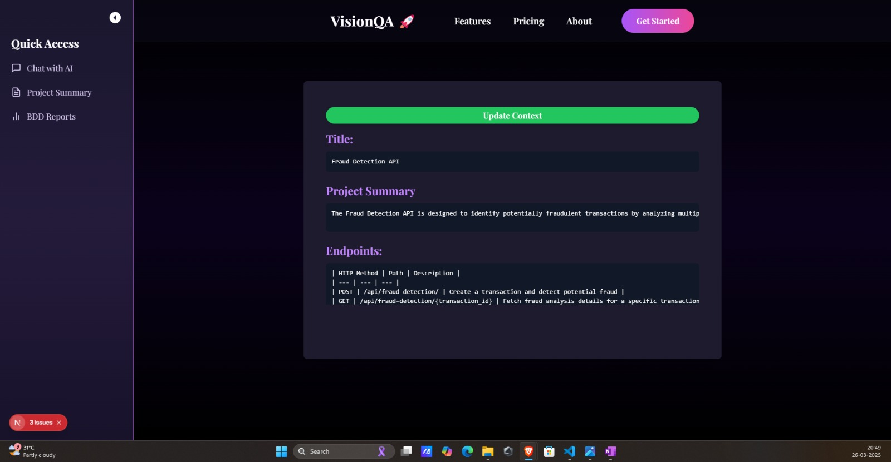
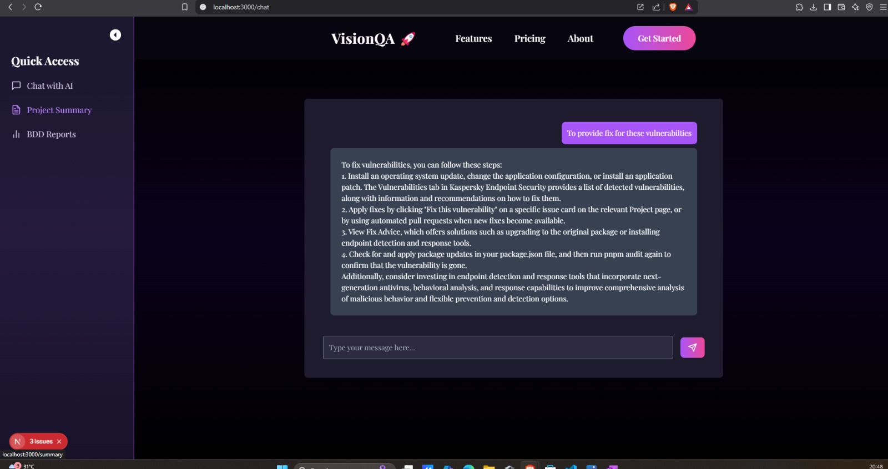
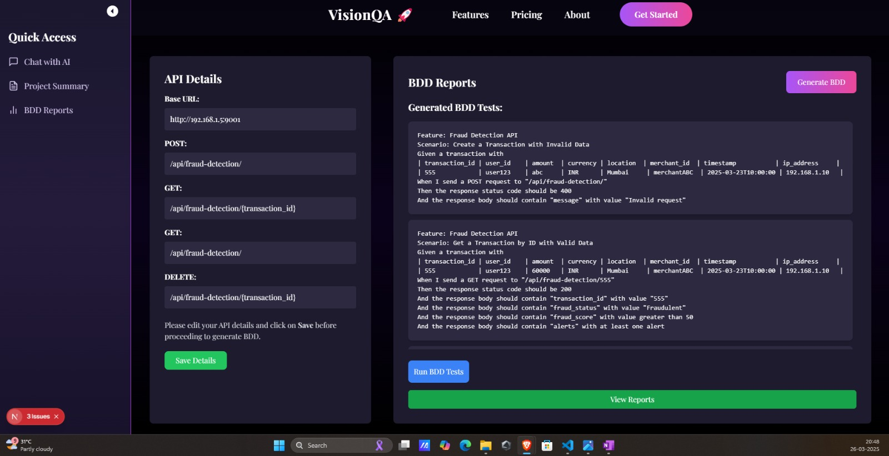
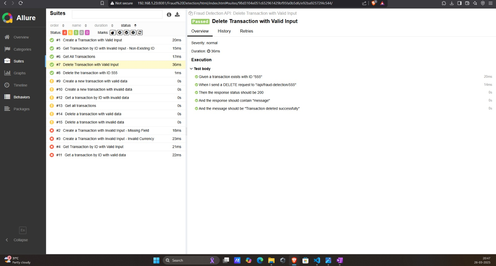
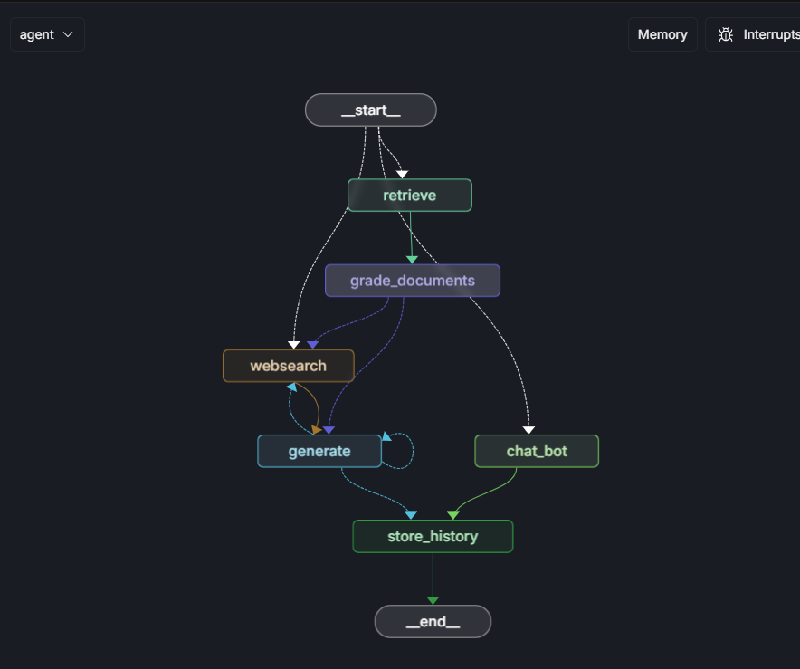

# Context-Aware Testing Application

## 🎯 Introduction
The Context-Aware Testing Application leverages LLM models to automate BDD test case generation and execution. It also provides project summaries and context-aware chat support to simplify the process of writing and executing BDD tests.

### Problem Statement
BDD testing is crucial for modern software development, but manual creation and maintenance of test cases can be time-consuming and error-prone. This application aims to streamline the process by leveraging LLMs for context-aware BDD generation and automated execution.

---

## 🎥 Demo 
📹 **Video Demo:** https://drive.google.com/file/d/1aYgrzA8HfzB8GE7Ex6YE-cmqOHhkR4eL/view?usp=sharing 

### 🖼️ Screenshots:
### Home Page


<br/>

### About Page


<br/>

### Project Summary


<br/>

### Chat Interface


<br/>

###  BDD Test Case Generation


<br/>

### Test Execution and Allure Report


<br/>

### Ai Agent

<br/>
#### <i>Our AI agent combines techniques from Adaptive RAG, Corrective RAG, and Self-RAG to enhance retrieval accuracy and reliability. It dynamically routes queries, falls back to web search when needed, and self-corrects responses to reduce hallucinations and improve answer quality.</i>
<br/>
---

## ⚙️ What It Does
- **User Onboarding:** Upload Confluence and JIRA URLs to extract data.
- **Project Summary:** Generates a comprehensive summary from contextual data.
- **Context-Aware Chat:** Provides project-related answers and insights.
- **BDD Test Case Generation:** Creates test cases based on contextual data.
- **Syntax Validation:** Validates BDD syntax with advanced LLM models.
- **Step Definition Generation:** Generates precise and executable step definitions.
- **Test Execution:** Runs tests and generates reports using Allure.
- **Reporting:** Provides a shareable URL for the generated reports.

---

## 🚧 Challenges We Faced
- Data chunking from unstructured content.
- Retrieving accurate context from vector embeddings.
- Validating syntax and generating precise step definitions.
- Reducing latency in generating chat responses.

---

## 🏃 How to Run

### Run the Backend
```bash
cd code/src/backend
pip install -r requirements.txt
uvicorn main:app --reload
```

### Run the Frontend
```bash
cd code/src/frontend/visionqa
npm install
npm start
```

### Start the LLM Model
```bash
cd code/src/model/
pip install -r requirements.txt
cd agent/
langgraph dev
```

---

## 🏗️ Tech Stack
- **Frontend:** React, Tailwind CSS
- **Backend:** FastAPI
- **Database:** Pinecone Vector DB
- **LLM:** Langchain, LLaMA, deepseek-r1-distill-llama-70b, deepseek-r1-distill-qwen-32b, Chat Groq API
- **Sentence Transformer:** sentence-transformers/all-mpnet-base-v2
- **Image Processing:** Salesforce BLIP, OCR
- **Testing and Reporting:** Behave, Allure

---

## 👥 Team
- **Atishay** - [GitHub](https://github.com/apatni24) 
- **Pranav** - [GitHub](https://github.com/psharma-4) 
- **Pratham** - [GitHub](https://github.com/pr-atha-m)
